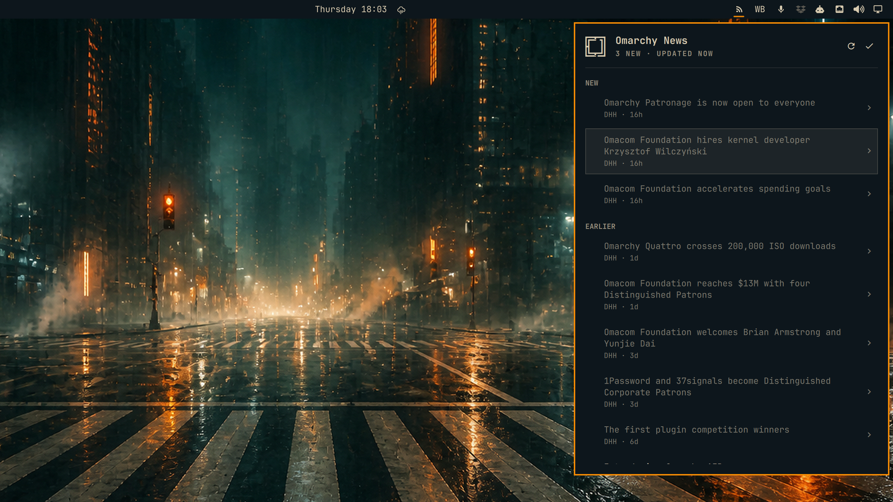
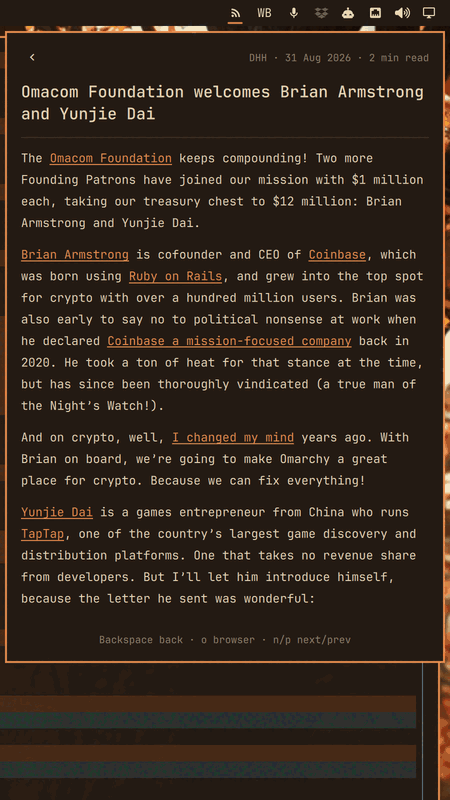
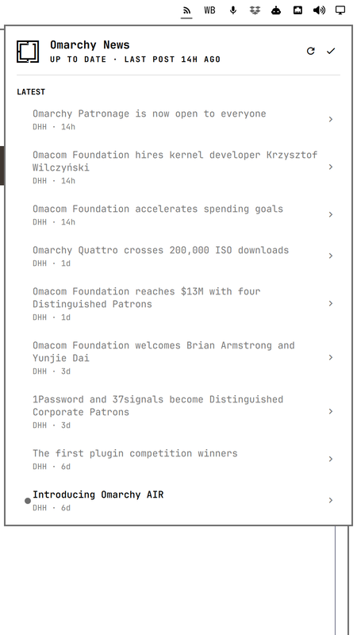
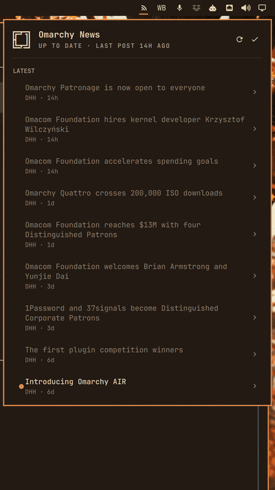

# Omarchy News

Every Omarchy announcement, read from the bar the moment it drops.



Omarchy News watches the official `omarchy.org/news` feed. It adds an unseen-post dot to the bar, a keyboard-first list, and a typeset reader that keeps the full article and its images inside the panel.

## Features

- Separates posts you have not seen from posts you have not read.
- Opens full articles with a page-turn transition and locally cached images.
- Follows the active Omarchy font and colour theme in dark and light modes.
- Sends one normal-priority Omarchy notification when a fetch finds new posts.
- Keeps the first run silent and continues from its last good cache when offline.
- Uses one shared service, even when the bar appears on more than one monitor.

## Install

```bash
omarchy plugin add https://github.com/eliasstravik/omarchy-news --enable
```

The command enables both the service and the bar widget. No second enable step is required.

## Keybinding

Add this to `~/.config/hypr/bindings.lua`:

```lua
o.bind("SUPER + CTRL + N", "Omarchy News", "omarchy-shell shell toggle io.github.eliasstravik.omarchy-news")
```

## Controls

### Post list

| Input | Action |
| --- | --- |
| Left click | Open the post in the reader. |
| Middle or right click | Open the post in the browser without closing the panel. |
| `j`, `k`, Down, Up | Reveal and move the post cursor. |
| Enter, Space, `l`, Right | Open the selected post in the reader. |
| `o` | Open the selected post in the browser and close the panel. |
| `x`, `m` | Toggle the selected post's read state. |
| `A` | Mark every post as read and show the five-second undo strip. |
| `u` | Undo the pending mark-all action. |
| `r` | Refresh the feed. |
| `g`, `G` | Jump to the first or last post. |
| `?` | Show or hide the complete controls. |
| Tab, Shift+Tab | Hand off to the neighbouring bar panel. |
| Escape | Close the controls or panel. |

### Reader

| Input | Action |
| --- | --- |
| Back button, Backspace, `h`, Left, Escape | Return to the post list. |
| `j`, `k`, Down, Up | Scroll by one step. |
| Space, Shift+Space | Page down or up. |
| `g`, `G` | Scroll to the top or bottom. |
| `n`, `p` | Open the next or previous post. |
| `o` | Open the post in the browser and keep the panel open. |
| Click an article link | Open that safe HTTP or HTTPS link in the browser. |

## Settings

| Setting | Default | Range | Example |
| --- | ---: | ---: | --- |
| `refreshMinutes` | 30 | 5 to 1440 | `omarchy bar set io.github.eliasstravik.omarchy-news refreshMinutes 15` |
| `notify` | `true` | Boolean | `omarchy bar set io.github.eliasstravik.omarchy-news notify false` |
| `maxPosts` | 40 | 10 to 100 | `omarchy bar set io.github.eliasstravik.omarchy-news maxPosts 60` |

## IPC

Use `omarchy-shell io.github.eliasstravik.omarchy-news <verb>` with `open`, `close`, `show`, `hide`, `toggle`, `refresh`, `markAllRead`, or `status`. The `status` verb prints JSON with the fetch state, post counts, unseen count, unread count, last fetch time, and any current error.

For example:

```bash
omarchy-shell io.github.eliasstravik.omarchy-news status
```

## How it works

The shared service fetches `https://omarchy.org/news/rss.xml` at startup and on the configured interval. It keeps up to `maxPosts` posts, uses the feed ETag for conditional requests, retries transient failures three times, and retains the last good snapshot when offline.

Seen and read are separate states. Opening the panel marks its current posts seen and freezes the NEW section for that opening. Opening or explicitly marking a post changes its read state. A fresh installation marks the initial feed seen but leaves every post unread, so installation never produces a backlog notification.

On later fetches, all genuinely new posts are grouped into one notification. Its title and optional cached image come from the newest post, and its click action opens the panel. The `notify` setting only controls these feed notifications; a corrupt-state recovery warning is always sent.

## What it executes exactly

Every process receives an argument vector directly. The plugin does not construct shell command strings, open sockets, or run a daemon.

- Creates its directories with `mkdir -p <cache> <image-cache> <state>`.
- Reads at most 262,145 bytes of state with `head -c 262145 <state-file>`.
- Fetches the feed with `curl -fsSL --proto =https --max-time 15 --max-filesize 2097152 --max-redirs 2 -A omarchy-news/0.1.0 --etag-compare <etag-file> --etag-save <etag-file> https://omarchy.org/news/rss.xml`.
- Checks and stores images with `test -s <image-file>`, `curl -fsSL --proto =https --max-time 20 --max-filesize 3145728 -o <part-file> <feed-image-url>`, and `mv -f <part-file> <image-file>`.
- Preserves invalid state with `mv <state-file> <dated-corrupt-file>`.
- Sends notices through `omarchy-notification-send`, with the app name `Omarchy News`, normal urgency for new posts, an optional cached image, and a fixed `omarchy-shell shell summon io.github.eliasstravik.omarchy-news {}` click action.
- Opens checked HTTP or HTTPS links with `omarchy-launch-browser <url>`.

## Data and privacy

The feed request contacts `omarchy.org`. Image requests only use HTTPS URLs published in that official feed. No analytics, account, cookie, or background server is involved.

The parsed feed and ETag live under `~/.cache/omarchy-news/`. Up to six images per retained post are cached under `~/.cache/omarchy-news/images/`, with a three-megabyte response limit for each download. Seen, read, notification, and last-opened timestamps live in `~/.local/state/omarchy-news/state.json`. State reads are capped at 256 KiB, and all JSON writes are atomic.

## Remove

```bash
omarchy plugin remove io.github.eliasstravik.omarchy-news --yes
rm -rf ~/.cache/omarchy-news ~/.local/state/omarchy-news
```

The first command removes the plugin. The second removes its feed cache, cached images, and local read history.

## Reader and light theme







## Local development

Run the portable parser, state, manifest, and source checks on any machine with Node.js:

```bash
node --test tests/*.test.mjs
bash tests/qml-source-test.sh
```

Run the Omarchy-specific checks on an Omarchy machine:

```bash
omarchy plugin validate .
/usr/lib/qt6/bin/qmllint -I /usr/share/omarchy/shell *.qml
```

Quickshell injects the plugin context and its `qs.*` imports at runtime, so a standalone `qmllint` may report those engine-provided names as unresolved. The live-shell log is the authoritative integration check.

## License

[MIT](LICENSE)
